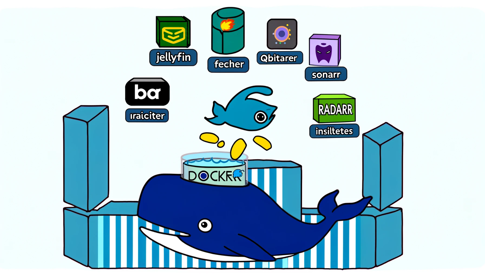

# Docker Media Server Setup

  

### Overview

**Important**: Configure a VPN before proceeding. Check my other project for configuring your own!

This Docker Compose file sets up a media server with Jellyfin, Nginx, qBittorrent, Radarr, and Sonarr.

### Inter-Container Communication

Use container names instead of IPs, for example, `http://nameofcontainer:port`.

## Requirements

- Docker
- Docker Compose

## Quick Start

1. **Clone the Repository**

```bash
   git clone https://github.com/Jallunator/MyMovieDocker.git
   cd MyMovieDocker
```

2. **Configuration Update the following files and paths**

+ +  Nginx Configuration
+ + SSL certificates if https ( not necessary needed if not in public network )

3. **Start the Services**
```bash
docker compose up -d
docker compose up --build -d
```

4. **Access the Services** ( Configure new passwords !)
+ Jellyfin: http://localhost:8096 # Player For installed media
+ WebTorrent add-on http://localhost:58827 # Streaming torrents
+ qBittorrent: http://localhost:8080 # Fetcher
+ + Username: admin Password: `docker compose logs | grep password`
+ Radarr: http://localhost:7878 # Movies
+ + Add qBitTorrent as download client 
+ + Add indexers in Jackett && Use this URL in Radar
+ + `http://jackett:9117/api/v2.0/indexers/all/results/torznab/`
+ Sonarr: http://localhost:8989 # Series
+ + Same with Jackett as in Radarr
+ Jackett: http://localhost:9117 # Handles all indexers as proxy
+ Bazarr: http://localhost:6767 # Subtitles


## File structure
```
├── config/
│   ├── jellyfin/
│   ├── qbittorrent/
│   ├── radarr/
│   └── sonarr/
├── cache/
├── media/
├── downloads/
├── nginx.conf
├── server.crt
└── server.key
```
## Monitor Logs
```bash
# With colors
./docker_logs.sh
```
## Monitor Containers
``` bash
docker stats
```

## Go inside container system
+ + Usually fixing permission issues
``` bash 
docker exec -it <container name> /bin/sh
```

## Stop Services 
``` bash 
docker-compose down
```

## Clean Up
```bash
docker-compose down -v
```
